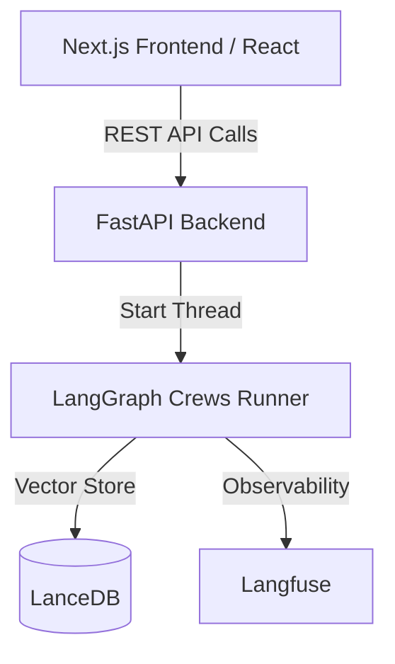

# Design Spec — Next.js UI & FastAPI Backend Rewrite

**Date:** 2026-06-14
**Status:** Approved

---

## Goal

Currently, the application is built as a single Streamlit script (`app.py`), which mixes UI layout, form inputs, local state tracking, scraping, and LangGraph model runs. This monolith is hard to scale, style, and deploy for production.

We will decouple the application into:
1. **A FastAPI Backend**: A REST API that runs the LangGraph crews asynchronously in background threads.
2. **A Next.js & Tailwind CSS Frontend**: A premium, state-of-the-art React application featuring guided intake wizard steps, real-time node execution progress, and a gorgeous, styled artifact output renderer.

---

## Proposed Architecture

### 1. Backend REST API (FastAPI)
The backend will expose endpoints for source discovery, task execution, status polling, and retrieving results. When a research task starts, it runs LangGraph in a background thread to prevent API blocking.

#### Endpoints
- **`POST /api/sources/discover`**:
  - Request: `{ "topic": str }`
  - Response: Scored & sorted list of sources for user curation.
- **`POST /api/research/start`**:
  - Request: `{ "brief": ResearchBriefData }`
  - Response: `{ "task_id": str, "status": "running" }`
- **`GET /api/research/status/{task_id}`**:
  - Response: `{ "task_id": str, "status": "pending|running|complete|failed", "active_node": str, "notes": list[str] }`
- **`GET /api/research/results/{task_id}`**:
  - Response: `{ "task_id": str, "artifacts": list[ArtifactData] }`

### 2. Frontend Application (Next.js, React, Tailwind CSS)
The frontend will provide a modern, premium dark-mode interface with smooth transitions, responsive layouts, and curated color palettes.

#### Page Structure
- `app/page.tsx` — Landing page detailing product capability and starting the wizard.
- `app/research/page.tsx` — 6-step guided intake wizard.
- `app/research/[task_id]/page.tsx` — Visual execution status tracker (polling status) and the premium artifact output renderer.
- `app/history/page.tsx` — Saved and past research runs.

#### Premium Output Rendering (Aesthetics)
- **Glassmorphism & Gradients**: Premium CSS container designs with subtle glowing borders for artifacts.
- **Interactive Formatting**: Collapsible accordions for citations, copyable code/text blocks, and formatted markdown rendering (using `react-markdown`).
- **Live Status Tracker**: Visually highlights which LangGraph node (e.g. `retrieve`, `analyse`, `generate_artifacts`) is executing.

---

## Out of Scope
- User Authentication (handled in future productization phase).
- Remote distributed task queues (e.g. Celery) — FastAPI background tasks are sufficient for single-instance scaling.
